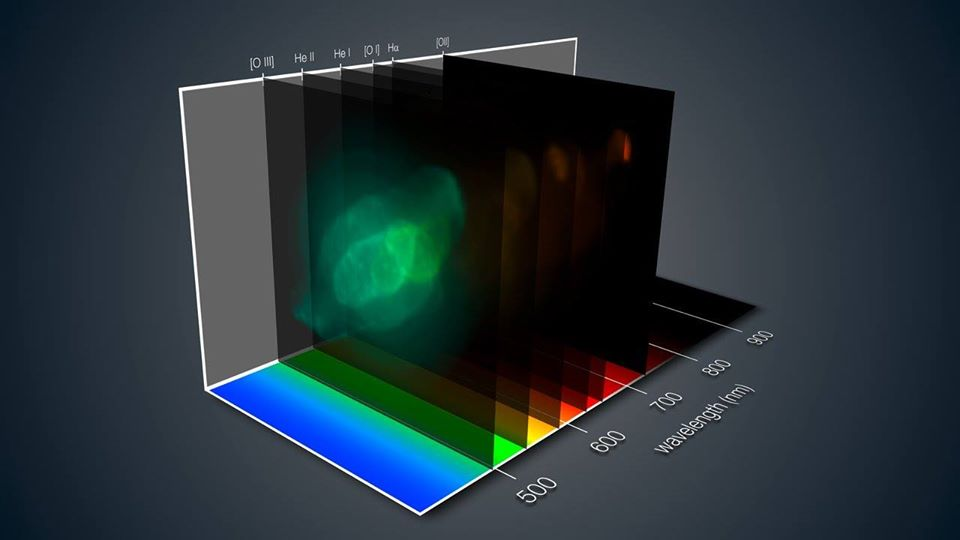

# radio-galaxy-study-MRC0943-242

## Background
This repository contains several Python scripts which I have used to carry out the data processing, extraction, analysis and visualisation of an astronomical datacube. 

The data have been acquired using the <a href="https://www.eso.org/public/teles-instr/paranal-observatory/vlt/">Very Large Telescope (VLT)</a> operated by the European Southern Obsevatory (ESO) and located at the Paranal Observatory in Chile. The instrument from whence the raw data have been sourced has a nice rockstar name - MUSE - which is an acronym for <a href="https://www.eso.org/sci/facilities/develop/instruments/muse.html">Multi-unit Spectroscopic Explorer</a>. MUSE is an integral field unit spectrograph that is capable of obtaining 1D spectra for every pixel in the field of view imaged by the telescope. It's very cool. 

The datacube produced from the raw observations is therefore a tensor which contains the pixel CCD (charged couple device) counts. In astronomical terms, the datacube represents a three dimensional Cartesian co-ordinate system where (x,y,z) are mapped to (right-ascension, declination, wavelength). The figure also demonstrates how spectral emission and absorption lines can be detected along the wavelength-axis e.g. [OIII], HeII, HeI and H&#x03B1;.

## The Project

In this specific project, the datacube is that of a distant radio galaxy with the catalogue name <a href="https://ned.ipac.caltech.edu/byname?objname=MRC%200943-242&hconst=67.8&omegam=0.308&omegav=0.692&wmap=4&corr_z=1">MRC0943-242</a> . The datacube provides the image of a projected area that is approximately 500 kpc x 500 kpc and a wavelength range that spans 450 - 930 nm in the optical regime of the electromagnetic spectrum. In terms of studying the physics of this distant galaxy, this observational data permits us to constrain the kinematics, mass and structure of the ionised gas surrounding this galaxy.

## Usage
This collection of Python scripts are customised to my specific use-case. However, they can easily be used as a template for performing similar data analyses. 

Python dependencies:
- Astronomy: MPDAF, AstroPy, WCS
- Linear algebra & calculus: SciPy, NumPy, Math Math
- Visualization: Matplotlib
- Model fitting: LMFIT
- Others: Warnings, Itertools, 

A report of the methodology and findings of this data analysis have been published in the peer-reviewed paper Kolwa et al 2019b in the journal 'Astronomy & Astrophysics'. The paper is  available for free download on the astro-ph archive of Astrophysics papers: https://arxiv.org/abs/1904.05114

[1] Credit: ESO Astronomy/J. Walsh